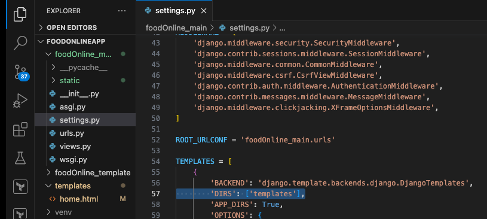

## Multi Vendor App - Django

### Create Django Proj
- django-admin startproject foodOnline_main .
- here . represents cur dir level

### Configure Templates for Django to ref frontend from templates folder
- 'DIRS': ['templates'],
- 

### Configure static folder and static floder path
- STATIC_ROOT = BASE_DIR /'static'
- STATICFILES_DIRS = [
    'foodOnline_main/static'
]

### For every page you want static files then add this in that file
- 
- To load css from static folder  - 	<link href="" rel="stylesheet">

### Collect static command - Production
- python manage.py collectstatic

### Postgres Data is saved here
- /Library/PostgreSQL/16/data

### Postgres Dependency package
- pip install psycopg2
- create new superuser for pg
- created .env for storing secrets fm public repo
- ref. https://pypi.org/project/python-decouple/

### Create your custom user models 
- 1->create user model 
- 2->tell user we are using which usermanager
- objects = UserManger()
- 3->tell django that we are using custom user not default 
- AUTH_USER_MODELS = 'accounts.User'

### Django Template Inheritance
- <body>
- <!--Load navbar here-->
-   
-     <!--Load content here-->
-     
-     <!--Our Content Goes here-->
-     
-     <!--Load footer here-->
-     
- 	<!--Main Wrapper-->
- Also add where static is used - 
- 

### Django Forms
- why do we pass context = {
        'form':form,
    }
-  the context dictionary is used to pass data from the view to the template. In your registeruser view function, you're passing a context that includes a form instance.
- class UserForm(forms.ModelForm):
    password = forms.CharField(widget=forms.PasswordInput())
- a widget is a representation of an HTML input element

### Django Password
- the set_password() method is used to securely hash and set the user's password
- Password:
algorithm: pbkdf2_sha256 iterations: 720000 salt: sSDMB3**************** hash: sCVPzL**************************************

### Django Messages
- Message.Tags do settings in setting.py for detecting error or succcess msg
- from django.contrib.messages import constants as messages
- MESSAGE_TAGS = {
    messages.ERROR: "danger",
}